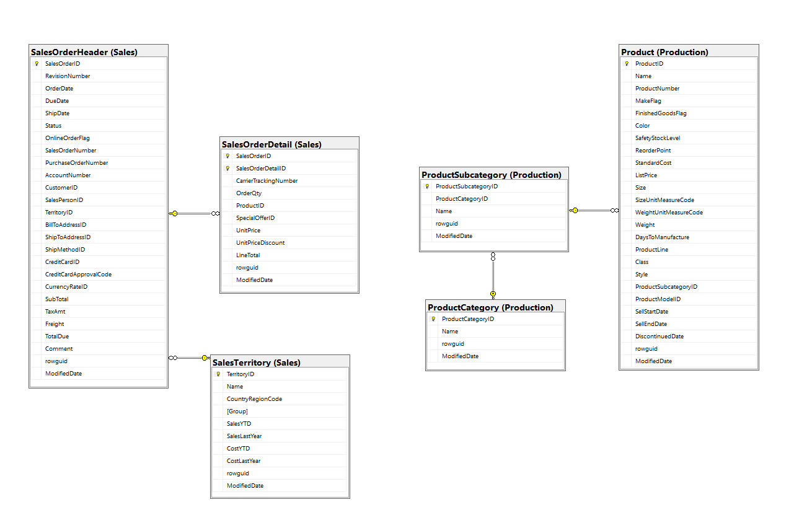
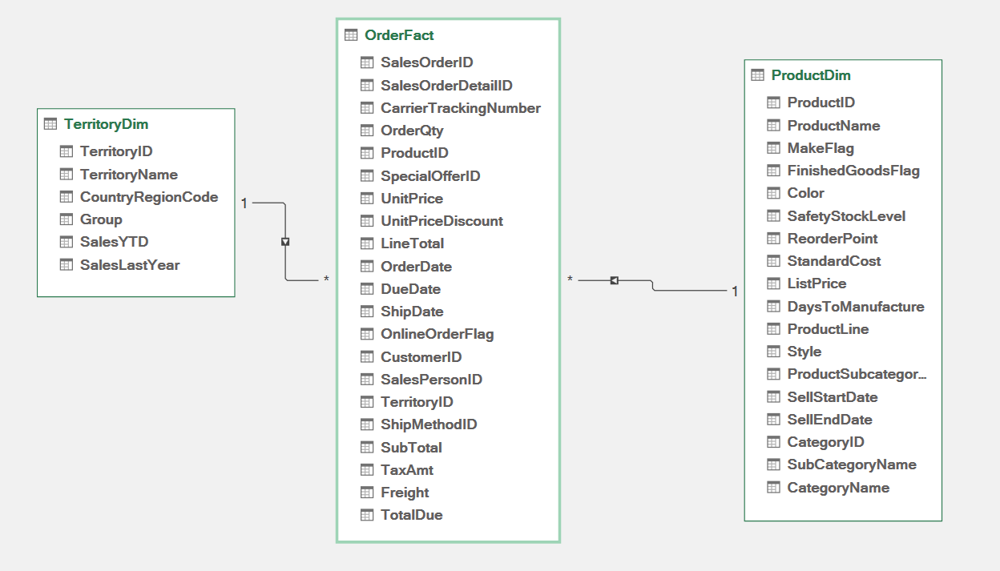
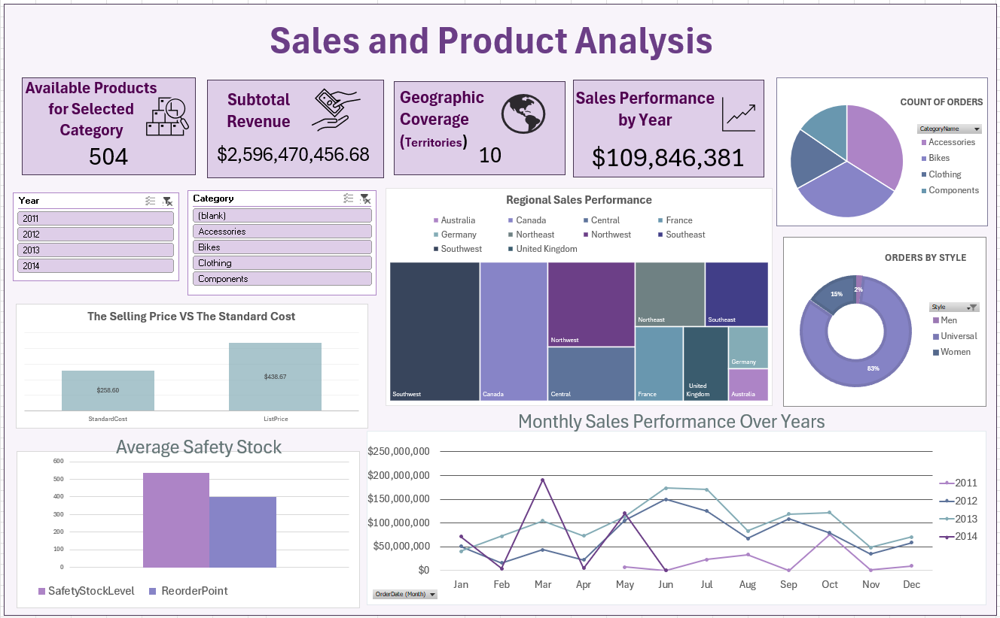

# Sales & Product Analysis Dashboard

Analysis of sales performance across regions, products, and time periods using Excel pivot tables and visualizations.

## Data
AdventureWorks 2022

## Key Insights
- Bikes dominate revenue generation.
- Accessories achieve exceptional sales efficiency With only 29 products.
- Only 10 territories currently covered and strong performance in regions like Canada and Southwest.
- The comparison between standard cost and list price shows strong markup potential.
- Inventory management appears optimized, The safety stock levels show a balanced approach with reorder points appropriately set.

## Data Model

### Relational Model

### Dimensional Model

**Fact Table:** Sales Orders Transactions

**Dimensions:**
- **Product Dimension:** Product, Category, Subcategory info
- **Territory Dimension:** Region, Country, State, Territory  

## Interactive Dashboard Features

### Dynamic Filtering with Slicers
The dashboard includes interactive slicers that enable real-time filtering across multiple visualizations:

**Available Filters:**
- **Year Slicer** (2011-2014)
- **Product Category** (Components, Bikes, Clothing, Accessories)

### **Connected Visualizations:**
- KPI cards (Sales Performance by Year & Available Products by Category) recalculate dynamically.
- The Selling Price VS The Standard Cost recalculate dynamically based on the selected Category
- Average Safety Stock and the Reorder Point for each Category
- Monthly Sales Performance Over Years updates to show filtered year trend.

